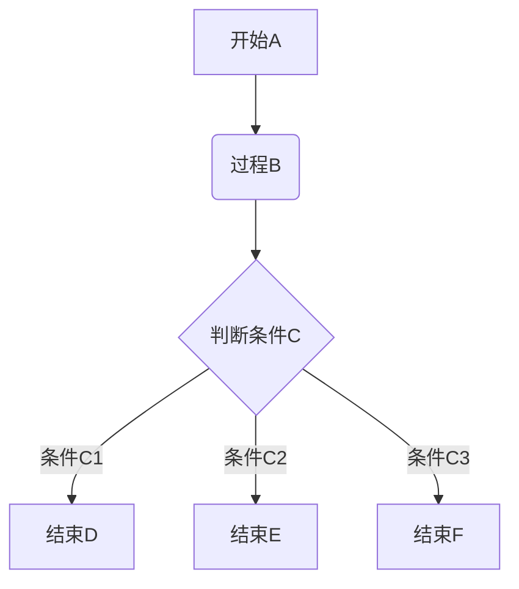
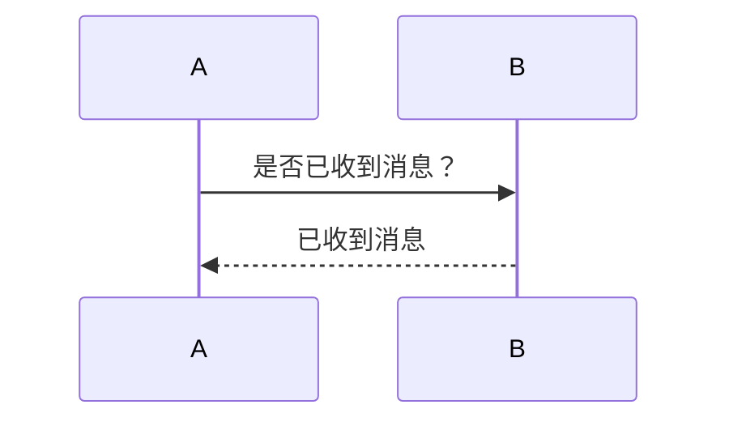
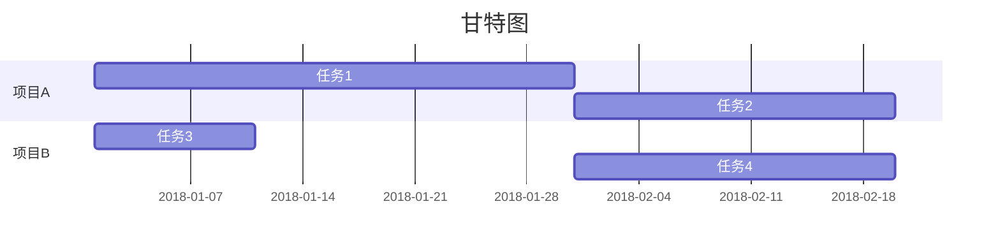

## 二级标题

### 三级标题

### 三级标题

#### 四级标题

##### 五级标题

###### 六级标题题题题题题题题题题

`asjgfuaksgfuagskfbakjsfbkjasgkdgasukdgukasdukasukdhukahdkahsdhakshdasjgfuaksgfuagskfbakjsfbkjasgkdgasukdgukasdukasukdhukahdkahsdhakshd`

<h1 id="h1html" style="background: red;">h1html</h1>
<script>
    console.log("md输出");
</script>

段落正常字体
_段落斜体_
**段落粗体**
**_段落粗斜体_**

---

~~删除线~~
<u>下划线</u>

- 无序项

1. 有序项 1
2. 有序项 2
3. 有序项 3
   1. 嵌套项
   2. asd
   - 嵌套项

> 区块引用
>
> > 一层嵌套引用
> >
> > > 二层嵌套引用
> > >
> > > > > > > > > > > 十层嵌套引用.....

`printf("这是一个代码片段"); //代码片段`

```C
printf("这是一个代码块");
//代码块
```

| 左对齐         |      居中      |         右对齐 |
| :------------- | :------------: | -------------: |
| 这是一个单元格 | 这是一个单元格 | 这是一个单元格 |
| 这是一个单元格 | 这是一个单元格 | 这是一个单元格 |

[内联方式<code>123a</code>超链接](/posts/test/)

[引用方式超链接][引用式]

[引用式]: /posts/test/

|    图片方式    |                                                         图片                                                          |
| :------------: | :-------------------------------------------------------------------------------------------------------------------: |
|    图片内联    |                  |
|    图片引用    |                                                    ![1][引用图片]                                                     |
| 图片内联超链接 | [](/posts/test/) |
| 图片引用超链接 |                                              [![1][引用图片]][引用链接]                                               |

[引用图片]: https://www.runoob.com/wp-content/uploads/2019/03/iconfinder_markdown_298823.png "引用图片属性"
[引用链接]: /posts/test/

\*\*使用转义字符\*\*

LaTeX\_($LaTeX: E=mc^2$)\_LaTex
$$LaTeX: E=mc^2$$

```chart
,数值一,数值二,数值三
类型1,5000,8000,4000
类型2,3000,1000,4000
类型3,5000,7000,6000
类型4,7000,2000,3000

type: column
title: 柱状图
x.title: 类型
x.suffix: 单位x
y.title: 数值
y.suffix: 单位y
```

```math
e^{i\pi} + 1 = 0 //(Just English Allow Here)
```







## 快捷键

|        功能        |       键位       |
| :----------------: | :--------------: |
| 新建 Markdown 笔记 |    Ctrl+Alt+D    |
|        粗体        |      Ctrl+B      |
|        斜体        |      Ctrl+I      |
|       删除线       |      Ctrl+T      |
|       下划线       |      Ctrl+U      |
|       分隔线       | Ctrl + Shift + - |
|      编号列表      | Ctrl + Shift + O |
|    项目符号列表    | Ctrl + Shift + W |
|    插入待办事项    | Ctrl + Shift + C |
|       代码块       |   Ctrl+Shift+L   |
|   插入日期和时间   | Alt + Shift + D  |
|        撤销        |      Ctrl+Z      |
|    在笔记内搜索    |      Ctrl+F      |

## Test

TTTTTTT

### 下面是一张图片


### Code 1

```js
// 语法结构
while (条件) {
  需要执行的代码;
}

// 该循环永远不会结束，这可能导致浏览器崩溃。
while (true) {
  console.log("加菲猫！");
}

const arr = ["1", "2", undefined, "3", "", "4"];
let i = 0;
while (arr[i]) {
  console.log(arr[i]);
  i = i + 1;
}
// 输出: 1
// 输出: 2

const arr = ["1", "2", "3", "4"];
let i = 0;
while (arr[i]) {
  console.log(arr[i]);
  i = i + 1;
}
```

### Code 2

```C# {.hide asdfff=asdfff close=asfasg}
static void Web()
{
    // 加载配置
    string webConfigFile = "WebConfig.json";
    WebConfig webConfig;
    if (!File.Exists(webConfigFile))
    {
        webConfig = new();
        webConfig.Port = 8082;
        File.WriteAllText(webConfigFile, JsonConvert.SerializeObject(webConfig, Formatting.Indented));
    }
    else webConfig = JsonConvert.DeserializeObject<WebConfig>(File.ReadAllText(webConfigFile))!;

    Serve.Run(RunOptions.Default
        .Silence()
        .AddComponent<ServeServiceComponent>().UseComponent<ServeApplicationComponent>()
        .ConfigureServices(services =>
        {
            services.AddJwt();
            services.AddJsonOptions(configure => configure.JsonSerializerOptions.Converters.AddDateTimeTypeConverters("yyyy-MM-dd HH:mm:ss.fff"));
        })
        .ConfigureBuilder(builder =>
        {
            builder.WebHost.UseUrls($"http://*:{webConfig.Port}");
        })
        .Configure(app =>
        {
            app.UseInject(option =>
            {
                option.ConfigureSwaggerUI(ui =>
                {
                    ui.RoutePrefix = "swagger";
                });
            });

            app.UseAuthentication();
            app.UseAuthorization();
        }));

    //Serve.Run($"http://*:{webConfig.Port}", silence: true, additional: services =>
    //{
    //    services.AddJsonOptions(configure => configure.JsonSerializerOptions.Converters.AddDateTimeTypeConverters("yyyy-MM-dd HH:mm:ss.fff"));
    //});
}
```

### Table

| 账户   | 密码   | 备注 |
| ------ | ------ | ---- |
| asdasd | asdasd | aaa  |
| asdasd | asdasd | aaa  |
| asdasd | asdasd | aaa  |

### Code 3


static void Web(1)
{
// 加载配置
string webConfigFile = "WebConfig.json";
WebConfig webConfig;
if (!File.Exists(webConfigFile))
{
webConfig = new();
webConfig.Port = 8082;
File.WriteAllText(webConfigFile, JsonConvert.SerializeObject(webConfig, Formatting.Indented));
}
else webConfig = JsonConvert.DeserializeObject<WebConfig>(File.ReadAllText(webConfigFile))!;
Serve.Run(RunOptions.Default
.Silence()
.AddComponent<ServeServiceComponent>().UseComponent<ServeApplicationComponent>()
.ConfigureServices(services =>
{
services.AddJwt();
services.AddJsonOptions(configure => configure.JsonSerializerOptions.Converters.AddDateTimeTypeConverters("yyyy-MM-dd HH:mm:ss.fff"));
})
.ConfigureBuilder(builder =>
{
builder.WebHost.UseUrls($"http://*:{webConfig.Port}");
        })
        .Configure(app =>
        {
            app.UseInject(option =>
            {
                option.ConfigureSwaggerUI(ui =>
                {
                    ui.RoutePrefix = "swagger";
                });
            });
            app.UseAuthentication();
            app.UseAuthorization();
        }));
    //Serve.Run($"http://\*:{webConfig.Port}", silence: true, additional: services =>
//{
// services.AddJsonOptions(configure => configure.JsonSerializerOptions.Converters.AddDateTimeTypeConverters("yyyy-MM-dd HH:mm:ss.fff"));
//});
}

